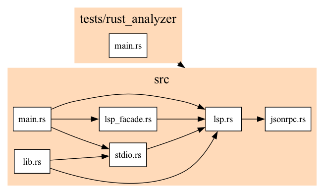

# LSP outside the editor

[LSP](https://microsoft.github.io/language-server-protocol/) (Language Server Protocol) was created in order to simplify both editor and language tooling (converts the MxN problem to an M + N problem).
Although not it's original purpose, we can also use LSP to write static analysis tools, independent of an editor. Since LSP is language-agnostic, these tools will also work on any language (only those that have language servers, of course).

This article can be:

1. A reference for writing code that communicates with LSP servers.

2. An overview of how LSP client/servers work.

3. Hopefully, inspiration for creating tools that use LSP is new ways.

# The project

Write a CLI tool that generates a graph showing references between
files in a project. For example, if `main.rs` uses code from `lib.rs`,
then `main.rs` and `lib.rs` will be nodes, and `(main.rs, lib.rs)`
will be an edge.

We will design the tool to work well with the
[Unix Philosophy](https://en.wikipedia.org/wiki/Unix_philosophy).
It will receive a list of files via standard input, the project root
uri, and the command to start the lsp server.

Example usage:

```bash
$ find . -type f -name '*.rs' | code-graph file://$PWD/ rust-analyzer
{
  "edges": [
    ["src/main.rs", "src/lsp_facade.rs"],
    ["tests/rust_analyzer/main.rs", "src/lsp_facade.rs"],
    ["src/lib.rs", "src/stdio.rs"],
    ["src/stdio.rs", "src/lib.rs"],
    ["src/main.rs", "src/stdio.rs"],
    ["src/main.rs", "src/lsp.rs"],
    ["src/lsp.rs", "src/lsp_facade.rs"],
    ["src/lsp_facade.rs", "src/lsp.rs"],
    ["src/lib.rs", "src/lsp.rs"],
    ["src/lib.rs", "src/lsp_facade.rs"],
    ["tests/rust_analyzer/main.rs", "src/lsp.rs"],
    ["src/stdio.rs", "src/lsp.rs"],
    ["src/lsp.rs", "src/jsonrpc.rs"],
    ["src/lsp.rs", "src/lib.rs"],
    ["tests/rust_analyzer/main.rs", "src/stdio.rs"]
  ],
  "nodes": [
    "tests/rust_analyzer/main.rs",
    "src/lib.rs",
    "src/stdio.rs",
    "src/main.rs",
    "src/lsp_facade.rs",
    "src/lsp.rs",
    "src/jsonrpc.rs"
  ],
  "root": "file:///github.com/selfint/lsp-outside-the-editor/"
}
```

Later, we will write a simply script to plot this using `graphviz`,
resulting in something like this:



# Implementation

The Language Server Protocol works on top of the JSON-RPC protocol (with some
minor tweaks). As such, we will start with JSON-RPC, and build our way up.

We will implement the project in the following steps:

1. `jsonrpc.rs`: A very minimal implementation of the
   [JSON-RPC 2.0 spec](https://www.jsonrpc.org/specification).

1. `lsp.rs`: A client for communicating with LSP servers, designed
   in the [sans-io](https://youtu.be/7cC3_jGwl_U) pattern.

1. `stdio.rs`: An LSP IO implementation over standard in/out.

1. `lsp_facade.rs`: A [facade](https://refactoring.guru/design-patterns/facade)
   making the LSP client more ergonomic for our use case.

1. `main.rs`: Our CLI tool.

Let's setup the project:

```sh
$ cargo new --lib lsp-client
```

Run `cargo test` to make sure everything works.

### Dependencies

We need:

1. `anyhow` - for simpler error handling in Rust.
2. `lsp-types` - for all the types in the [LSP specification](https://microsoft.github.io/language-server-protocol/specifications/lsp/3.17/specification/).
3. `serde`, `serde_json` - for serializing/deserializing data to/from JSON.

In the `Cargo.toml` file:

```toml
# Cargo.toml
[package]
name = "lsp-client"
version = "0.1.0"
edition = "2021"

[dependencies]
anyhow = "1.0.69"
lsp-types = "0.95.1"
serde = { version = "1.0.154", features = ["derive"] }
serde_json = "1.0.137"
```

## 1. JSON-RPC

This is the base protocol over which we will implement LSP.

While there are other Rust implementations of the
[JSON-RPC specification](https://www.jsonrpc.org/specification) already, they
are a bit too complicated for this project. Our implementation will
be very simple.

### JSON-RPC crash course

JSON-RPC has 3 message types:

- `Request` - has an `id`, which its respective `Response` will also have.
- `Notication` - is a `Request` without an `id`, and thus has no `Response`.
- `Response` - can either contain a `result`, or an `error` value.

Example `Request` and `Response`:

```json
{"jsonrpc": "2.0", "method": "sub", "params": [4, 2], "id": 1}
{"jsonrpc": "2.0", "result": 2, "id": 1}
```

Example `Notification`:

```json
{ "jsonrpc": "2.0", "method": "notify", "params": { "status": "ok" } }
```

Notice that there is no `Response` for `Notification`, and that `params` can
either be a JSON `list` or `object` type.

Example `Response` with `error`:

```json
{"jsonrpc": "2.0", "method": "foobar", "id": "1"}
{"jsonrpc": "2.0", "error": {"code": -32601, "message": "Method not found"}, "id": "1"}
```

### Code

The implementation of the `Request` and `Notification` structs is very simple:

```rs
// src/jsonrpc.rs
use anyhow::anyhow;

use serde::{Deserialize, Serialize};
use serde_json::Value;

#[derive(Serialize, Deserialize, Debug)]
pub struct Request<Params> {
    pub jsonrpc: String,
    pub method: String,
    #[serde(skip_serializing_if = "Option::is_none")]
    pub params: Option<Params>,
    pub id: i64,
}

#[derive(Serialize, Deserialize, Debug)]
pub struct Notification<Params> {
    pub jsonrpc: String,
    pub method: String,
    #[serde(skip_serializing_if = "Option::is_none")]
    pub params: Option<Params>,
}
```

Notice that there is no validation ensuring the correct
method/param/data types together. We will take care of that in
the LSP-specific code later.

The `Result` type is a bit trickier, since the JSON has either a `result` field
or an `error` field. To handle this, we use the
[`serde(flatten)`](https://serde.rs/attr-flatten.html) feature:

```rust
#[derive(Serialize, Deserialize, Debug)]
pub struct Response<T> {
    pub jsonrpc: String,
    #[serde(flatten)]
    pub result: JsonRpcResult<T>,
    pub id: Option<i64>,
}

#[derive(Serialize, Deserialize, Debug)]
#[serde(rename_all = "lowercase")]
pub enum JsonRpcResult<T> {
    Result(T),
    Error {
        code: i64,
        message: String,
        #[serde(skip_serializing_if = "Option::is_none")]
        data: Option<Value>,
    },
}
```

We can also add a generic type for the `Error.data` field, instead of any
JSON `Value`. Since we do not use the error value in our project, I opted for
this simpler implementation.

Finally, for ergonomics later on, we will implement a conversion from
`JsonRpcResult` to an `anyhow::Result`:

```rust
impl<T> From<JsonRpcResult<T>> for anyhow::Result<T> {
    fn from(value: JsonRpcResult<T>) -> Self {
        match value {
            JsonRpcResult::Result(result) => Ok(result),
            JsonRpcResult::Error {
                code,
                message,
                data,
            } => Err(anyhow!("Error ({}) {}: {:?}", code, message, data)),
        }
    }
}
```

And we are done!

> While writing the definitions, I used the [insta](https://github.com/mitsuhiko/insta) library for writing the tests. You can view the tests [here](https://github.com/selfint/fn-usage/blob/7a117e281b4861b97bf2e5913b5cb9b9ee25a2da/jsonrpc-types/src/lib.rs#L39).

## 2. LSP

Here we take care of two things:

1. Ensure type safety for JSON-RPC messages.
2. Manage a counter to ensure `Request`/`Response` pairs have unique ids.

We will use the [sans-io](https://youtu.be/7cC3_jGwl_U) pattern, which helps
both with testing and extending the client to other transfers (although we
will only implement standard in/out).

To get strong typing support (and safe serialization/deserialization) we will
use the [lsp-types](https://docs.rs/lsp-types/0.95.1/lsp_types/index.html) crate.
The nice thing about this crate is how it ties the `method` string of a JSON-RPC
message together with its `params` and `Result` objects using
[Associated Types](https://doc.rust-lang.org/rust-by-example/generics/assoc_items/types.html).

For example, here is the [`Request`](https://docs.rs/lsp-types/0.95.1/lsp_types/request/trait.Request.html) trait:

```rs
pub trait Request {
    type Params: DeserializeOwned + Serialize + Send + Sync + 'static;
    type Result: DeserializeOwned + Serialize + Send + Sync + 'static;
    const METHOD: &'static str;
}
```

And the [Goto Defintion Request](https://microsoft.github.io/language-server-protocol/specifications/lsp/3.17/specification/#textDocument_definition) implementation:

```rs
/// The goto definition request is sent from the client to the server to resolve the definition location of
/// a symbol at a given text document position.
#[derive(Debug)]
pub enum GotoDefinition {}

impl Request for GotoDefinition {
    type Params = GotoDefinitionParams;
    type Result = Option<GotoDefinitionResponse>;
    const METHOD: &'static str = "textDocument/definition";
}
```

Thanks to the good folks at [Gluon Lang](https://github.com/gluon-lang), we
have this amazing [dx](https://github.blog/enterprise-software/collaboration/developer-experience-what-is-it-and-why-should-you-care/) for the entire LSP
specification!

> Regarding `lsp-types` version, see
> [Issue 284](https://github.com/gluon-lang/lsp-types/issues/284). For the sake
> of brevity, we do not use the latest version since it switched to a more
> verbose `Uri` implementation.

### Code

First we define the `StringIO` and `Client` objects:

```rs
use anyhow::Result;
use lsp_types::{notification::Notification, request::Request};
use serde_json::Value;

use crate::jsonrpc;

pub trait StringIO {
    fn send(&mut self, msg: &str) -> Result<()>;
    fn recv(&mut self) -> Result<String>;
}

pub struct Client<IO: StringIO> {
    io: IO,
    request_id_counter: i64,
}
```

Next we implement the `Client`:

- `new` - Constructor.
- `notify` - Just sends a `Notification` to the server.
- `request` - Sends a `Request` to the server and returns the `Response`.

The `new` and `notify` methods are straightforward:

```rs
impl<IO: StringIO> Client<IO> {
    pub fn new(io: IO) -> Self {
        Self {
            io,
            request_id_counter: 0,
        }
    }

    pub fn notify<N: Notification>(&mut self, params: Option<N::Params>) -> Result<()> {
        let notification = jsonrpc::Notification {
            jsonrpc: "2.0".to_string(),
            method: N::METHOD.to_string(),
            params,
        };

        self.io.send(&serde_json::to_string(&notification)?)
    }
}
```

Notice how the `notify` function leverages the `Notication` trait from
`lsp-types` to ensure type safety between the `method` and `param` fields.

The `request` method is a little tricky, since we not only send a `Request` but
we also need to return the **matching** `Response`.

To do this, after we send the `Request` with some `id`, we receive messages
from the server until we get a `Response` that has the same `id`.

To make sure the message is a `Response` and not a server-sent `Request` (which can
also have a matching `id`, since client-sent and server-sent request ids can
overlap), we ensure the message has no `method` field.

```rs
impl<IO: StringIO> Client<IO> {
    /* ... snip ... */

    pub fn request<R: Request>(&mut self, params: Option<R::Params>) -> Result<R::Result> {
        let request = jsonrpc::Request {
            jsonrpc: "2.0".to_string(),
            method: R::METHOD.to_string(),
            params,
            id: self.request_id_counter,
        };

        self.io.send(&serde_json::to_string(&request)?)?;

        let response: jsonrpc::Response<_> = loop {
            let response: Value = serde_json::from_str(&self.io.recv()?)?;

            // check if this is our response
            if response.get("method").is_none()
                && response
                    .get("id")
                    .is_some_and(|id| id.as_i64() == Some(self.request_id_counter))
            {
                break serde_json::from_value(response)?;
            }
        };

        self.request_id_counter += 1;

        response.result.into()
    }
}
```

And again we used the `Request` trait from `lsp-types` to ensure type safety
between the `method` and `param` fields, and this time also the `Response`
itself.

That's all. All the code is inside the `lib.rs` file.

## 3. StdIO

```rs
use std::io::{BufRead, BufReader, Write};
use std::process::{Child, ChildStdin, ChildStdout};

use anyhow::{Context, Result};

use crate::lsp;

pub struct StdIO {
    stdin: ChildStdin,
    stdout: BufReader<ChildStdout>,
}

impl StdIO {
    pub fn new(child: &mut Child) -> Result<Self> {
        let stdin = child.stdin.take().context("child has no stdin")?;
        let stdout = BufReader::new(child.stdout.take().context("child has no stdout")?);

        Ok(Self { stdin, stdout })
    }
}

impl lsp::StringIO for StdIO {
    fn send(&mut self, msg: &str) -> Result<()> {
        let length = msg.as_bytes().len();
        let msg = &format!("Content-Length: {}\r\n\r\n{}", length, msg);

        self.stdin
            .write_all(msg.as_bytes())
            .context("writing msg to stdin")
    }

    fn recv(&mut self) -> Result<String> {
        let mut content_length = None;

        loop {
            let mut line = String::new();
            self.stdout
                .read_line(&mut line)
                .context("reading line from stdout")?;

            let words = line.split_ascii_whitespace().collect::<Vec<_>>();

            match (words.as_slice(), &content_length) {
                (["Content-Length:", c_length], None) => content_length = Some(c_length.parse()?),
                (["Content-Type:", _], Some(_)) => {}
                ([], Some(content_length)) => {
                    let mut content = Vec::with_capacity(*content_length);
                    let mut bytes_left = *content_length;
                    while bytes_left > 0 {
                        let read_bytes = self.stdout.read_until(b'}', &mut content).unwrap();
                        bytes_left -= read_bytes;
                    }

                    let content = String::from_utf8(content).unwrap();
                    return Ok(content);
                }
                unexpected => panic!("Got unexpected stdout: {:?}", unexpected),
            };
        }
    }
}

```

## 4. Facade

```rs
use anyhow::Result;
use lsp_types::{
    notification::{DidOpenTextDocument, Initialized},
    request::{DocumentSymbolRequest, GotoDefinition, Initialize, References},
    DocumentSymbol, DocumentSymbolResponse, GotoDefinitionResponse, ServerCapabilities, SymbolKind,
    Url,
};
use serde_json::json;

use crate::{Client, StringIO};

impl<IO: StringIO> Client<IO> {
    pub fn open(&mut self, uri: Url, text: &str) -> Result<()> {
        self.notify::<DidOpenTextDocument>(
            serde_json::from_value(json!({
                "textDocument": {
                    "uri": uri,
                    "languageId": "",
                    "version": 1,
                    "text": text
                }
            }))
            .unwrap(),
        )
    }

    pub fn references(&mut self, uri: Url, symbol: &DocumentSymbol) -> Result<Vec<Url>> {
        let references = self.request::<References>(
            serde_json::from_value(json!({
                "textDocument": {
                    "uri": uri,
                },
                "position": symbol.selection_range.start,
                "context": {
                    "includeDeclaration": false
                }
            }))
            .unwrap(),
        )?;

        Ok(references
            .unwrap_or_default()
            .into_iter()
            .map(|r| r.uri)
            .collect())
    }

    pub fn goto_definition(&mut self, uri: Url, symbol: &DocumentSymbol) -> Result<Vec<Url>> {
        let definition = self.request::<GotoDefinition>(
            serde_json::from_value(json!({
            "textDocument": {
                "uri": uri,
            },
            "position": symbol.selection_range.start,
            }))
            .unwrap(),
        )?;

        let definition = if let Some(definition) = definition {
            match definition {
                GotoDefinitionResponse::Scalar(location) => vec![location.uri],
                GotoDefinitionResponse::Array(vec) => vec.into_iter().map(|l| l.uri).collect(),
                GotoDefinitionResponse::Link(vec) => {
                    vec.into_iter().map(|l| l.target_uri).collect()
                }
            }
        } else {
            vec![]
        };

        Ok(definition)
    }

    pub fn symbols(&mut self, uri: Url, mask: &[SymbolKind]) -> Result<Vec<DocumentSymbol>> {
        let symbols = self.request::<DocumentSymbolRequest>(
            serde_json::from_value(json!({
                "textDocument": {
                    "uri": uri
                },
            }))
            .unwrap(),
        )?;

        let symbols = match symbols {
            Some(DocumentSymbolResponse::Nested(vec)) => {
                let mut symbols = vec![];
                let mut queue = vec;

                // flatten nested document symbols
                while let Some(symbol) = queue.pop() {
                    symbols.push(symbol.clone());
                    if let Some(children) = symbol.children {
                        queue.extend(children);
                    }
                }

                if mask.len() == 0 {
                    symbols
                } else {
                    symbols
                        .into_iter()
                        .filter(|s| mask.contains(&s.kind))
                        .collect()
                }
            }
            Some(DocumentSymbolResponse::Flat(flat)) => {
                if flat.len() > 0 {
                    panic!("Got non-empty flat documentSymbol response")
                }

                vec![]
            }
            None => vec![],
        };

        Ok(symbols)
    }

    pub fn initialize(&mut self, uri: Url) -> Result<ServerCapabilities> {
        let response = self.request::<Initialize>(
            serde_json::from_value(json!({
                "capabilities": {
                    "textDocument": {
                        "documentSymbol": {
                            "hierarchicalDocumentSymbolSupport": true,
                        }
                    },
                },
                "workspaceFolders": [{
                    "uri": uri,
                    "name": "name"
                }]
            }))
            .unwrap(),
        )?;

        self.notify::<Initialized>(None)?;

        Ok(response.capabilities)
    }
}

```

## 5. CLI

```rs
use std::collections::HashSet;
use std::io::{BufRead, BufReader};
use std::process::{Command, Stdio};
use std::str::FromStr;

use anyhow::Result;
use lsp_types::{SymbolKind, Url};
use serde_json::json;

use lsp_client::{Client, StdIO};

fn main() -> Result<()> {
    let args: Vec<_> = std::env::args().collect();

    if args.len() < 3 {
        eprintln!("Usage: {} <root-uri> <lsp-cmd> [lsp-cmd-args...]", args[0]);
        std::process::exit(1);
    }

    let (root, cmd, args) = (&args[1], &args[2], &args[3..]);

    let root = Url::from_str(&root)?;
    eprintln!("Using root: {}", &root.as_str());

    // read all lines from stdin
    let uris: Vec<Url> = std::io::stdin()
        .lock()
        .lines()
        .filter_map(Result::ok)
        .filter_map(|line| root.join(&line).ok())
        .collect();

    let mut child = Command::new(cmd)
        .args(args)
        .stdin(Stdio::piped())
        .stdout(Stdio::piped())
        .stderr(Stdio::piped())
        .spawn()?;

    let mut client = Client::new(StdIO::new(&mut child)?);

    // start stderr logging thread
    let stderr = child.stderr.take().expect("Failed to take stderr");
    std::thread::spawn(move || {
        let reader = BufReader::new(stderr);
        for line in reader.lines() {
            match line {
                Ok(line) => eprintln!("stderr: {}", line),
                Err(err) => panic!("Error reading stderr: {}", err),
            }
        }
    });

    let capabilities = client.initialize(root.clone())?;

    if capabilities.document_symbol_provider.is_none() {
        anyhow::bail!("Server is not 'textDocument/documentSymbol' provider");
    }

    if capabilities.references_provider.is_none() {
        anyhow::bail!("Server is not 'textDocument/reference' provider");
    }

    let mut edges: HashSet<(String, String)> = HashSet::new();

    for (i, uri) in uris.iter().enumerate() {
        eprintln!(
            "Loading uri ({:>4}/{:>4}): {}",
            i + 1,
            uris.len(),
            uri.as_str()
        );

        let text = std::fs::read_to_string(uri.path())?;
        client.open(uri.clone(), &text)?;
    }

    eprintln!("Waiting 3 seconds for LSP to index code...");
    std::thread::sleep(std::time::Duration::from_secs(3));

    for (i, uri) in uris.iter().enumerate() {
        eprintln!(
            "Scanning uri ({:>4}/{:>4}): {}",
            i + 1,
            uris.len(),
            uri.as_str()
        );

        // ignore uri not under root
        let Some(symbol_node) = uri.as_str().strip_prefix(root.as_str()) else {
            continue;
        };

        let symbols = client.symbols(
            uri.clone(),
            &[
                SymbolKind::FUNCTION,
                SymbolKind::STRUCT,
                SymbolKind::CLASS,
                SymbolKind::METHOD,
            ],
        )?;

        for (j, symbol) in symbols.iter().enumerate() {
            eprintln!(
                "Searching symbol ({:>4}/{:>4}): {:?} {}",
                j + 1,
                symbols.len(),
                symbol.kind,
                symbol.name,
            );

            let definitions = client.goto_definition(uri.clone(), symbol)?;
            if !definitions
                .iter()
                .any(|d| d.as_str().starts_with(root.as_str()))
            {
                eprintln!(
                    "Ignoring symbol outside of root, defined at: {:?}",
                    definitions.iter().map(|d| d.as_str()).collect::<Vec<_>>()
                );

                continue;
            }

            for reference in client.references(uri.clone(), symbol)? {
                // ignore symbols defined outside of project root
                if reference != *uri && uris.contains(&reference) {
                    let reference_node = reference.as_str().strip_prefix(root.as_str()).unwrap();
                    eprintln!("Found reference: {} -> {}", reference_node, symbol_node);

                    edges.insert((reference_node.to_string(), symbol_node.to_string()));
                }
            }
        }
    }

    let nodes: Vec<_> = uris
        .iter()
        .filter_map(|u| u.as_str().strip_prefix(root.as_str()))
        .collect();

    println!(
        "{}",
        json!({
            "root": root,
            "nodes": nodes,
            "edges": edges
        })
    );

    Ok(())
}

```
