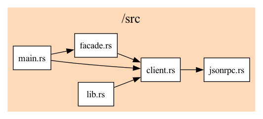

# LSP outside the editor

[LSP](https://microsoft.github.io/language-server-protocol/) (Language Server Protocol) was created in order to simplify both editor and language tooling (converts the MxN problem to an M + N problem).
Although not it's original purpose, we can also use LSP to write static analysis tools, independent of an editor. Since LSP is language-agnostic, these tools will also work on any language (only those that have language servers, of course).

This article can be:

1. A reference for writing code that communicates with LSP servers.

2. An overview of how LSP client/servers work.

3. Hopefully, inspiration for creating tools that use LSP is new ways.

# The project

Write a CLI tool that generates a graph showing references between
files in a project. For example, if `main.rs` uses code from `lib.rs`,
then `main.rs` and `lib.rs` will be nodes, and `(main.rs, lib.rs)`
will be an edge.

We will design the tool to work well with the
[Unix Philosophy](https://en.wikipedia.org/wiki/Unix_philosophy).
It will receive a list of files via standard input, the project root
uri, and the command to start the lsp server.

Example usage:

```bash
$ find . -type f -name '*.rs' | code-graph file://$PWD/ rust-analyzer
{
  "edges": [
    ["src/main.rs", "src/lsp_facade.rs"],
    ["tests/rust_analyzer/main.rs", "src/lsp_facade.rs"],
    ["src/lib.rs", "src/stdio.rs"],
    ["src/stdio.rs", "src/lib.rs"],
    ["src/main.rs", "src/stdio.rs"],
    ["src/main.rs", "src/lsp.rs"],
    ["src/lsp.rs", "src/lsp_facade.rs"],
    ["src/lsp_facade.rs", "src/lsp.rs"],
    ["src/lib.rs", "src/lsp.rs"],
    ["src/lib.rs", "src/lsp_facade.rs"],
    ["tests/rust_analyzer/main.rs", "src/lsp.rs"],
    ["src/stdio.rs", "src/lsp.rs"],
    ["src/lsp.rs", "src/jsonrpc.rs"],
    ["src/lsp.rs", "src/lib.rs"],
    ["tests/rust_analyzer/main.rs", "src/stdio.rs"]
  ],
  "nodes": [
    "tests/rust_analyzer/main.rs",
    "src/lib.rs",
    "src/stdio.rs",
    "src/main.rs",
    "src/lsp_facade.rs",
    "src/lsp.rs",
    "src/jsonrpc.rs"
  ],
  "root": "file:///github.com/selfint/lsp-outside-the-editor/"
}
```

Later, we will write a simply script to plot this using `graphviz`,
resulting in something like this:



# Implementation

The Language Server Protocol works on top of the JSON-RPC protocol (with some
minor tweaks). As such, we will start with JSON-RPC, and build our way up.

We will implement the project in the following steps:

1. `jsonrpc.rs`: A very minimal implementation of the
   [JSON-RPC 2.0 spec](https://www.jsonrpc.org/specification).

1. `lsp.rs`: A client for communicating with LSP servers, designed
   in the [sans-io](https://youtu.be/7cC3_jGwl_U) pattern.

1. `stdio.rs`: An LSP IO implementation over standard in/out.

1. `lsp_facade.rs`: A [facade](https://refactoring.guru/design-patterns/facade)
   making the LSP client more ergonomic for our use case.

1. `main.rs`: Our CLI tool.

Let's setup the project:

```sh
$ cargo new --lib lsp-client
```

Run `cargo test` to make sure everything works.

### Dependencies

We need:

1. `anyhow` - for simpler error handling in Rust.
2. `lsp-types` - for all the types in the [LSP specification](https://microsoft.github.io/language-server-protocol/specifications/lsp/3.17/specification/).
3. `serde`, `serde_json` - for serializing/deserializing data to/from JSON.

In the `Cargo.toml` file:

```toml
# Cargo.toml
[package]
name = "lsp-client"
version = "0.1.0"
edition = "2021"

[dependencies]
anyhow = "1.0.69"
lsp-types = "0.95.1"
serde = { version = "1.0.154", features = ["derive"] }
serde_json = "1.0.137"
```

## 1. JSON-RPC

This is the base protocol over which we will implement LSP.

While there are other Rust implementations of the
[JSON-RPC specification](https://www.jsonrpc.org/specification) already, they
are a bit too complicated for this project. Our implementation will
be very simple.

### JSON-RPC crash course

JSON-RPC has 3 message types:

- `Request` - has an `id`, which its respective `Response` will also have.
- `Notication` - is a `Request` without an `id`, and thus has no `Response`.
- `Response` - can either contain a `result`, or an `error` value.

Example `Request` and `Response` (`<--` is to **client**, `-->` is to **server**):

```json
--> {"jsonrpc": "2.0", "method": "sub", "params": [4, 2], "id": 1}
<-- {"jsonrpc": "2.0", "result": 2, "id": 1}
```

Example `Notification`:

```json
--> {"jsonrpc": "2.0", "method": "notify", "params": {"status": "ok"}}
```

Notice that there is no `Response` for `Notification`, and that `params` can
either be a JSON `list` or `object` type.

Example `Response` with `error`:

```json
--> {"jsonrpc": "2.0", "method": "foobar", "id": "1"}
<-- {"jsonrpc": "2.0", "error": {"code": -32601, "message": "Method not found"}, "id": "1"}
```

### Code

The implementation of the `Request` and `Notification` is very simple:

```rs
// src/jsonrpc.rs
use anyhow::anyhow;

use serde::{Deserialize, Serialize};
use serde_json::Value;

#[derive(Serialize, Deserialize, Debug)]
pub struct Request<Params> {
    pub jsonrpc: String,
    pub method: String,
    #[serde(skip_serializing_if = "Option::is_none")]
    pub params: Option<Params>,
    pub id: i64,
}

#[derive(Serialize, Deserialize, Debug)]
pub struct Notification<Params> {
    pub jsonrpc: String,
    pub method: String,
    #[serde(skip_serializing_if = "Option::is_none")]
    pub params: Option<Params>,
}
```

Notice that there is no validation between ensuring the correct
method/param/data types together. We will take care of that in
the LSP-specific code later.

The `Result` type is a bit trickier, since the JSON has either a `result` field
or an `error` field. To handle this, we use the
[`serde(flatten)`](https://serde.rs/attr-flatten.html) feature:

```rust
#[derive(Serialize, Deserialize, Debug)]
pub struct Response<T> {
    pub jsonrpc: String,
    #[serde(flatten)]
    pub result: JsonRpcResult<T>,
    pub id: Option<i64>,
}

#[derive(Serialize, Deserialize, Debug)]
#[serde(rename_all = "lowercase")]
pub enum JsonRpcResult<T> {
    Result(T),
    Error {
        code: i64,
        message: String,
        #[serde(skip_serializing_if = "Option::is_none")]
        data: Option<Value>,
    },
}
```

We can also add a generic type for the `Error.data` field, instead of any
JSON `Value`. Since we do not use the error value in our project, I opted for
this simpler implementation.

Finally, for ergonomics later on, we will implement a conversion from
`JsonRpcResult` to an `anyhow::Result`:

```rust
impl<T> From<JsonRpcResult<T>> for anyhow::Result<T> {
    fn from(value: JsonRpcResult<T>) -> Self {
        match value {
            JsonRpcResult::Result(result) => Ok(result),
            JsonRpcResult::Error {
                code,
                message,
                data,
            } => Err(anyhow!("Error ({}) {}: {:?}", code, message, data)),
        }
    }
}
```

And we are done!

## 2. LSP

Here we take care of two things:

1. Ensure type safety for JSON-RPC messages.
2. Manage a counter to ensure `Request`/`Response` pairs have unique ids.

We will use the [sans-io](https://youtu.be/7cC3_jGwl_U) pattern, which helps
both with testing and extending the client to other transfers (although we
will only implement standard in/out).

To get strong typing support (and safe serialization/deserialization) we will
use the [lsp-types](https://docs.rs/lsp-types/0.95.1/lsp_types/index.html) crate.
The nice thing about this crate is how it ties the `method` string of a JSON-RPC
message together with its `params` and `Result` objects. For example:

https://docs.rs/lsp-types/0.95.1/src/lsp_types/request.rs.html#337-346

https://github.com/stevemar/code-reference-in-readme/blob/031e04f922c14ecd5b03a79d8c979ba8f3ab1e39/src/main.py#L1-L6

> Regarding `lsp-types` version, see
> [Issue 284](https://github.com/gluon-lang/lsp-types/issues/284). For the sake
> of brevity, we do not use the latest version since it switched to a more
> verbose `Uri` implementation.

### Code

First we define the `StringIO` and `Client` objects:

```rs
use anyhow::Result;
use lsp_types::{notification::Notification, request::Request};
use serde_json::Value;

use crate::jsonrpc;

pub trait StringIO {
    fn send(&mut self, msg: &str) -> Result<()>;
    fn recv(&mut self) -> Result<String>;
}

pub struct Client<IO: StringIO> {
    io: IO,
    request_id_counter: i64,
}
```

Next we implement the `Client`, it will only have two functions (and a constructor):

- `request` - Sends a `Request` to the server and returns the `Response`.
- `notify` - Just sends a `Notification` to the server.

The `new` and `notify` methods are straightforward:

```rs
impl<IO: StringIO> Client<IO> {
    pub fn new(io: IO) -> Self {
        Self {
            io,
            request_id_counter: 0,
        }
    }

    pub fn notify<N: Notification>(&mut self, params: Option<N::Params>) -> Result<()> {
        self.io.send(&serde_json::to_string(&jsonrpc::Notification {
            jsonrpc: "2.0".to_string(),
            method: N::METHOD.to_string(),
            params,
        })?)
    }
}
```

That's all. All the code is inside the `lib.rs` file.

> While writing the definitions, I used the [insta](https://github.com/mitsuhiko/insta) library for writing the tests. You can view the tests [here](https://github.com/selfint/fn-usage/blob/7a117e281b4861b97bf2e5913b5cb9b9ee25a2da/jsonrpc-types/src/lib.rs#L39).

### Client

## 2. LSP Client

Our LSP client is really just a JSON-RPC client, that only sends LSP messages.
For the LSP types, we will use the [lsp-types](https://github.com/gluon-lang/lsp-types) crate.

Setup the crate inside our workspace:

```sh
$ cargo new --lib lsp-client
```

And inside the root `Cargo.toml` file:

```toml
[workspace]
members = [
    "jsonrpc-types",
    "lsp-client"
]
```

Run `cargo test` again to make sure everything works.
